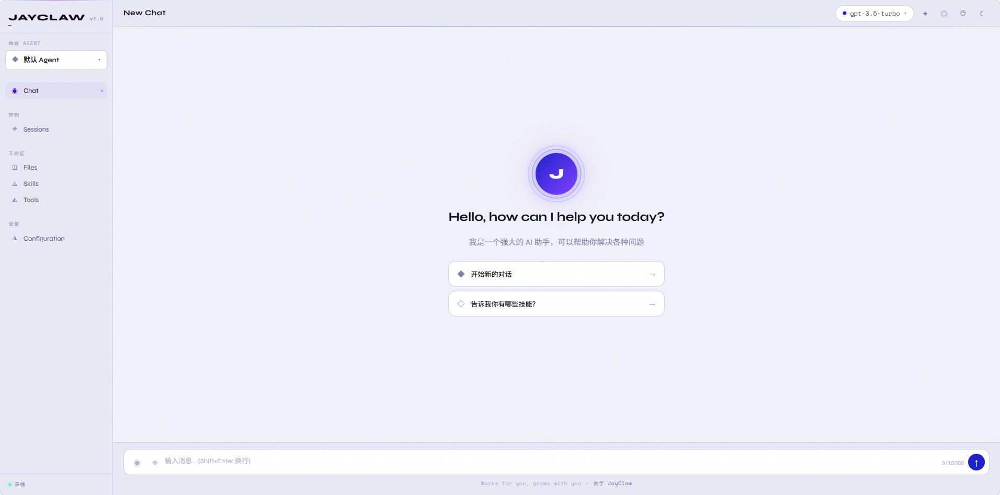

<div align="center">

# JayClaw

[](https://www.python.org/downloads/)
[](LICENSE)
[](https://github.com/astral-sh/ruff)


</div>


JayClaw 是一个模块化 Python AI Agent 框架，支持 14 个主流 LLM 提供商，提供 CLI、Web 前端、IDE 集成三种启动方式。框架具备完整的 Agent 运行时（树形会话、工具调用、技能系统、扩展插件）和生产级弹性设计（API Key 轮换、三级上下文压缩、模型降级），同时支持 Slack、Discord、Telegram、WhatsApp、飞书五个消息平台。

---

## 目录

- [快速开始](#快速开始)
- [三种启动方式](#三种启动方式)
- [主要特性](#主要特性)
- [最近新增能力](#最近新增能力)
- [包结构](#包结构)
- [支持的 LLM 提供商](#支持的-llm-提供商)
- [安全注意事项](#安全注意事项)
- [开发](#开发)
- [参与贡献](#参与贡献)
- [License](#license)

---

## 快速开始

### 1. 克隆并安装

```bash
git clone https://github.com/hujihuji630/jayclaw.git
cd jayclaw

# 推荐使用虚拟环境
python -m venv venv
source venv/bin/activate  # Windows: venv\Scripts\activate

# 安装所有包（顺序敏感：被依赖的包必须先装）
pip install -e "packages/jay-llm"
pip install -e "packages/jay-tui"
pip install -e "packages/jay-agent-core"
pip install -e "packages/jay-agent-tools[web]"
pip install -e "packages/jay-coding-agent"
pip install -e "packages/jay-web-ui"

# 可选：消息平台 Bot（Slack / Discord / Telegram / WhatsApp / 飞书）
# pip install -e "packages/jay-messenger"
```

### 2. 配置 API Key

在 `examples/` 目录下复制模板并填写你的 API Key：

```bash
cp examples/.env.example examples/.env
```

然后编辑 `examples/.env`，取消注释并填写对应的 Key：

```bash
# OpenAI
LLM_PROVIDER=openai
OPENAI_API_KEY=sk-xxx
LLM_MODEL=gpt-4o

# 或 Anthropic Claude
# LLM_PROVIDER=anthropic
# ANTHROPIC_API_KEY=sk-ant-xxx
# LLM_MODEL=claude-3-5-sonnet-20241022

# 或 DeepSeek（兼容 OpenAI 格式）
# LLM_PROVIDER=openai
# API_KEY=your-deepseek-key
# LLM_BASE_URL=https://api.deepseek.com/v1
# LLM_MODEL=deepseek-chat

# 或本地 Ollama（无需 API Key）
# LLM_PROVIDER=openai
# API_KEY=ollama
# LLM_BASE_URL=http://localhost:11434/v1
# LLM_MODEL=llama3
```

### 3. 启动 Web 前端（推荐）

```bash
cd examples
python start_web_ui.py
```

打开浏览器访问 **http://127.0.0.1:8000** 即可开始对话。

---

## 三种启动方式

### 方式一：Web 前端

通过 [`examples/start_web_ui.py`](examples/start_web_ui.py) 启动带有 CodingAgent 后端的 Web 聊天界面。

**启动步骤：**

```bash
# 1. 配置 examples/.env（参考上方快速开始）

# 2. 启动服务器
cd examples
python start_web_ui.py
```

启动后终端输出示例：

```
JayClaw Web UI (Coding Agent)
────────────────────────────────────────
  URL:         http://127.0.0.1:8000
  Provider:    openai
  Model:       gpt-4o
  Temperature: 0.7
  Workspace:   .
────────────────────────────────────────
按 Ctrl+C 停止服务器
```



**Web UI 特性：**

- 实时流式响应（SSE）
- 深色 / 浅色主题切换
- 文件上传支持
- 消息历史记录
- 响应式设计，支持移动端

**环境变量配置：**

| 变量 | 默认值 | 说明 |
|------|--------|------|
| `LLM_PROVIDER` | `openai` | LLM 提供商 |
| `LLM_MODEL` | `gpt-3.5-turbo` | 模型名称 |
| `LLM_BASE_URL` | — | 自定义 API 地址（兼容 OpenAI 格式） |
| `LLM_TEMPERATURE` | `0.7` | 温度参数 (0.0–2.0) |
| `LLM_MAX_TOKENS` | `2000` | 最大 token 数 |
| `{PROVIDER}_API_KEY` | — | 对应提供商的 API Key |
| `API_KEY` | — | 通用 API Key（优先级低于特定提供商） |
| `PORT` | `8000` | 服务器端口 |
| `HOST` | `127.0.0.1` | 服务器地址 |
| `CHAT_TITLE` | `JayClaw Chat` | 页面标题 |

---

### 方式二：CLI 终端

通过 `claw` 命令在终端中与 Agent 交互，适合开发调试和脚本集成。

```bash
# 设置 API Key
export OPENAI_API_KEY=your-key

# 启动交互式终端
claw --provider openai --model gpt-4o

# 指定工作目录
claw --provider openai --model gpt-4o --path /path/to/project

# 使用 DeepSeek
claw --provider openai --model deepseek-chat \
     --base-url https://api.deepseek.com/v1 \
     --api-key your-deepseek-key
```

**常用 CLI 命令（交互中输入）：**

| 命令 | 说明 |
|------|------|
| `/help` | 查看所有命令（共 30+） |
| `/files` | 列出工作区文件 |
| `/status` | 查看 Agent 状态与会话信息 |
| `/cost` | 查看实时 token 消耗与费用 |
| `/export` | 将当前会话导出为 HTML |
| `/share` | 将会话发布为 GitHub Gist |
| `/clear` | 清空对话历史 |
| `/exit` | 退出 |

**消息队列与文件引用：**

```bash
# 在 Agent 处理中途排队下一条指令（! 前缀）
! 先别提交，等我确认一下

# 追加跟进消息（>> 前缀）
>> 顺便把测试也补上

# 用 @filename 自动将文件内容注入上下文
请帮我 review @src/auth.py 和 @tests/test_auth.py
```

**启动参数：**

```bash
claw --help                    # 查看所有参数
claw --resume                  # 恢复上次会话
claw --no-extensions           # 禁用扩展插件
claw --mode json               # JSON 输出模式（适合脚本集成）
claw --mode rpc                # RPC 模式（程序化调用）
```

---

### 方式三：IDE 集成

在 VS Code 或 PyCharm 的集成终端中运行 `claw`，Agent 可直接读写工作区文件。

**VS Code 任务配置（`.vscode/tasks.json`）：**

```json
{
  "version": "2.0.0",
  "tasks": [
    {
      "label": "JayClaw Agent",
      "type": "shell",
      "command": "claw --provider openai --model gpt-4o --path ${workspaceFolder}",
      "presentation": {
        "reveal": "always",
        "panel": "new"
      }
    }
  ]
}
```

通过 `Ctrl+Shift+P` → `Tasks: Run Task` → `JayClaw Agent` 启动。

---

## 主要特性

### 多提供商统一接入

通过 `jay-llm` 统一封装 14 个 LLM 提供商，切换模型只需改一行配置，无需修改业务代码。兼容所有 OpenAI 格式的自定义端点（DeepSeek、Ollama、LM Studio 等）。详见[支持的 LLM 提供商](#支持的-llm-提供商)。

### 树形会话管理

会话以树形结构组织，支持分支与分叉——可以从任意历史节点开启新的对话分支，而不影响原有上下文。每个分支独立维护消息历史和工具调用记录，会话状态可序列化保存并跨进程恢复（`claw --resume`）。

### 三层弹性容错

LLM 调用失败时按顺序尝试三种恢复策略：

1. **API Key 轮换** — 遇到速率限制（429）、认证失败（401/403）或超时时，自动切换到下一个可用 Key，并对失败的 Key 按错误类型设置差异化冷却时间：
   - 速率限制：60 秒冷却
   - 认证失败：300 秒冷却
   - 账单问题：3600 秒冷却
   - 超时：30 秒冷却

2. **三级上下文压缩** — 触发 context overflow 时依次尝试：截断旧消息 → 摘要压缩 → LLM 辅助压缩，压缩后自动重试，无需手动干预。

3. **模型降级** — 压缩后仍失败则自动切换到备用模型（如 gpt-4o → gpt-3.5-turbo），保证请求最终完成。

三层之间使用指数退避（1s → 2s → 4s），全部耗尽后抛出 `ResilienceExhaustedError` 并附带完整的重试链路记录。

### 工具系统

工具通过 `ToolRegistry` 统一管理，运行时可随时注册或注销，无需重启 Agent。工具 schema 自动转换为 OpenAI function calling 格式，对所有支持工具调用的模型透明可用。

工具执行支持以下控制机制：
- **确认门（Confirmation Gate）** — 对高风险工具（如文件写入、Shell 命令）可配置执行前人工确认
- **并行 / 顺序执行** — 多工具调用可按依赖关系选择并行或顺序执行策略
- **备用映射（Fallback Mapping）** — 工具调用失败时自动路由到备用实现

### 扩展插件

`ExtensionAPI` 在 Agent 启动时从 `.agents/extensions/` 目录动态发现并加载插件，支持通过装饰器注册自定义工具、斜杠命令和事件处理器：

```python
@api.tool(description="查询数据库")
def query_db(sql: str) -> str:
    ...

@api.command("stats")
def show_stats():
    ...

@api.on("tool_call")
def on_tool_call(event):
    ...
```

### 技能系统

技能以 Markdown 文件（`SKILL.md`）形式存放在 `.agents/skills/` 目录，Agent 启动时自动发现并注入到系统提示。每个技能描述触发条件、执行步骤和输出格式，无需修改代码即可扩展 Agent 的专项能力。

### 上下文感知

Agent 启动时自动读取工作目录中的上下文文件：
- **`AGENTS.md`** — 项目级 Agent 配置，定义工具权限、行为约束和项目背景
- **`SYSTEM.md`** — 项目感知的系统提示，注入到每次对话的上下文中

### 提示词模板

内置模板系统支持变量替换，可在提示词中引用运行时变量（文件内容、环境信息、会话状态等），减少重复的上下文拼接代码。

### 可插拔内存

内存层通过统一接口抽象，支持替换为自定义存储后端（内存、文件、数据库、向量库等），无需修改 Agent 核心逻辑。

### 成本追踪

实时统计每次 LLM 调用和工具使用的 token 消耗，结合各提供商价格数据计算实际费用，通过 `/cost` 命令随时查看。

### 可观测性

Agent 运行时通过事件回调（`AgentEventCallback`）暴露完整的执行链路，包括工具调用、弹性重试、上下文压缩、计费等关键节点，便于接入外部监控系统。

### 多平台消息

`jay-messenger` 提供统一的消息 API，同一套 Agent 代码无需修改即可接入 5 个平台：

| 平台 | 说明 |
|------|------|
| Slack | Bolt SDK，支持 App Mention 和 DM |
| Discord | discord.py，支持斜杠命令 |
| Telegram | python-telegram-bot |
| WhatsApp | Twilio API |
| 飞书 | 飞书开放平台 |

每个频道维护独立的会话上下文，互不干扰。

### 特色工具

除文件读写、Shell 执行等基础 Agent 工具外，`jay-agent-tools` 还内置了几个实用工具：网络搜索（自动在 Tavily、Exa、Bing CN、百度间按优先级 fallback）、网页正文抓取、中英翻译（MyMemory 免费 API，无需注册）、拼音命名检测（扫描代码中的拼音标识符并给出英文替换建议）。完整示例见 [examples/chinese_dev_tools_demo.py](examples/chinese_dev_tools_demo.py)。

---

## 最近新增能力

下面这些能力在 P0/P1 阶段陆续落地，README 早期版本未覆盖，单独列在这里。

### AGENTS.md 工作目录自动维护

- **首次进入工作目录**：若根目录没有 `AGENTS.md`，CLI / Web UI 会询问是否生成一份「地图式」AGENTS.md（扫目录 + 一次 LLM 调用起草）。生成后自动注入到 system prompt，本次会话立刻生效。
- **会话结束时**：如果本次会话超过 2 轮用户输入，会询问是否将「踩坑教训 / 用户明确表达的硬约束」抽取出来追加到 Known Pitfalls / Always Loaded 段，写入前展示 unified diff 让你确认。
- **跳过策略**：选「永不」会写入 `.agents/.no-agents-md` 标记，今后不再询问；可用 `/agents-init`、`/agents-summarize` 强制重跑。
- 实现：[`jay_coding_agent.agents_md`](packages/jay-coding-agent/src/jay_coding_agent/agents_md.py)。

### 任务交接文档（HANDOFFS/）

当上下文撑得太满时，可以让 LLM 写一份结构化交接文档供新会话/新 Agent 接力：

- 在 Web UI 点击「Handoff」按钮，或 CLI 中输入 `/handoff [任务关键词]`。
- 文档落到 `<workspace>/HANDOFFS/handoff_YYYYMMDD_HHMMSS.md`，固定 6 个章节：原始目标 / 已完成 / 当前状态 / 待办 / 相关文件 / 关键决策与约束。
- LLM 调用失败会自动 fallback 到模板（基于历史的启发式抽取 + `.agents/progress.json`）。
- 新会话启动会自动检测最近的 handoff，并提示注入。
- 实现：[`jay_coding_agent.handoff`](packages/jay-coding-agent/src/jay_coding_agent/handoff.py)。

### 上下文利用率监控

- Web UI 标题栏会实时显示当前对话占模型上下文窗口的百分比，并按 40% / 70% / 85% 三档变色。
- CLI 命令 `/context` 显示同样的信息。
- 上下文窗口大小由 [`jay_llm.detect_context_window`](packages/jay-llm/src/jay_llm/context_window.py) 解析（family 前缀表 + provider 默认值 + `LLM_CONTEXT_WINDOW` 环境变量覆盖），覆盖 OpenAI / Anthropic / Gemini / DeepSeek / GLM / Qwen 等家族。
- 主动压缩走 `/api/compact`（Web UI 的 Compact 按钮），优先使用 LLM 摘要（Level 3），失败回退到结构化截断（Level 2）。

### 结构化进度追踪（.agents/progress.json）

- Agent 可在多步任务中通过 `update_progress` 工具更新一份结构化 JSON，记录每一步的状态（pending / in_progress / completed / failed）。
- Handoff 生成时会读取这份文件，让新会话直接看到「已经做完什么 / 还差什么」。
- 实现：[`jay_agent_core.progress`](packages/jay-agent-core/src/jay_agent_core/progress.py)。

### 端到端验证工具

- `cli_check(command, expected_exit_code, stdout_contains, …)`：跑一条 CLI 命令并断言退出码 / stdout。
- `http_check(url, expected_status, body_contains, …)`：HTTP 请求断言。
- `browser_check(url, action_script)`：可选的 Playwright 集成，给 UI 改动做"真的点过"验证。
- 三者统一返回 `CheckResult { name, status, message, duration_ms }`，便于 Agent 在「改完代码 → 自己验」流程中调用。
- 实现：[`jay_agent_tools.e2e`](packages/jay-agent-tools/src/jay_agent_tools/e2e/)。

### 面向 Agent 的 Linter 框架

`jay-agent-tools` 新增 `linters/` 子包，所有 Lint 都返回 `LintFinding { file, line, code, message, suggestion }`——给 Agent 看的不只是"你错了"，还附带"应该这么改"：

- `no_print`：检测残留 `print()`，建议改用 `logger`。
- `tool_envelope`：检测工具直接 return dict 而未走 `ToolResult` 包装。
- `internal_field`：检测 tool schema 内部字段未加 `_` 前缀。
- `pinyin_naming`：检测拼音命名并给出英文替换建议（含 camelCase / snake_case 两种风格）。

### 视觉模型降级

主模型不支持视觉时，可以在 Web UI 配置面板里指定一个视觉降级模型。当上传图片或扫描型 PDF 时，自动调用视觉模型先做内容提取，再把结果转交主模型回答——避免「主模型看不懂图直接拒答」。`process_attachments` 也会自动把扫描 PDF 渲染为 PNG（最多 20 页）。

### 流式 Agent 取消与转向

- Web UI 顶部「中止」按钮在生成中可点：后端 `/api/cancel` 设置 `_cancel_event`，前端 SSE 链路同步关闭——不再出现「前端切了后端还在跑」。
- 运行中输入 `! <内容>`（CLI）或在 Web UI 调用 `/api/interrupt`（POST `{message}`）能把"转向"消息插入 MessageQueue，Agent 在当前 tool 调用结束后立刻处理。

---

## 包结构

| 包 | 版本 | 说明 |
|---|---|---|
| **jay-llm** | v0.0.2 | 统一 LLM API，支持 14 个提供商 |
| **jay-agent-core** | v0.0.4 | Agent 运行时：工具调用、会话管理、技能系统 |
| **jay-agent-tools** | v0.0.1 | 网络搜索、翻译等工具集 |
| **jay-coding-agent** | v0.0.4 | 交互式编程助手 CLI（`claw` 命令）|
| **jay-tui** | v0.0.1 | 终端 UI 组件 |
| **jay-web-ui** | v0.0.1 | Web 聊天界面（FastAPI + SSE）|
| **jay-messenger** | v0.0.3 | 多平台 Bot（Slack / Discord / Telegram / 飞书）|

---

## 支持的 LLM 提供商

**主流**

| 提供商 | 环境变量 | 代表模型 |
|--------|----------|----------|
| OpenAI | `OPENAI_API_KEY` | GPT-4o、GPT-3.5 |
| Anthropic | `ANTHROPIC_API_KEY` | Claude 3.5 Sonnet |
| Google | `GOOGLE_API_KEY` | Gemini 1.5 Pro |
| Azure OpenAI | `AZURE_OPENAI_API_KEY` | Azure 托管 GPT-4 |

**高速推理**

| 提供商 | 环境变量 | 说明 |
|--------|----------|------|
| Groq | `GROQ_API_KEY` | LPU 加速，极低延迟 |
| Cerebras | `CEREBRAS_API_KEY` | 晶圆级芯片推理 |
| Together AI | `TOGETHER_API_KEY` | 开源模型托管 |

**专精**

| 提供商 | 环境变量 | 说明 |
|--------|----------|------|
| Mistral | `MISTRAL_API_KEY` | Mistral / Mixtral 系列 |
| Cohere | `COHERE_API_KEY` | Command 系列，擅长 RAG |
| DeepSeek | `API_KEY` + `LLM_BASE_URL` | 兼容 OpenAI 格式 |
| Perplexity | `PERPLEXITY_API_KEY` | 联网搜索增强 |

**聚合平台**

| 提供商 | 环境变量 | 说明 |
|--------|----------|------|
| OpenRouter | `OPENROUTER_API_KEY` | 统一接入 100+ 模型 |
| Amazon Bedrock | `AWS_ACCESS_KEY_ID` 等 | AWS 托管多模型 |
| xAI | `XAI_API_KEY` | Grok 系列 |

**本地模型（无需 API Key）**

```bash
# Ollama
LLM_PROVIDER=openai
API_KEY=ollama
LLM_BASE_URL=http://localhost:11434/v1
LLM_MODEL=llama3

# LM Studio
LLM_PROVIDER=openai
API_KEY=lmstudio
LLM_BASE_URL=http://localhost:1234/v1
LLM_MODEL=your-local-model
```

---

## 安全注意事项

JayClaw 默认面向**本地开发**场景。如果要把 Web UI 暴露到 `0.0.0.0` 或公网，请提前阅读以下条款，否则可能导致任意代码执行 / 文件泄漏：

### 真实凭证

- **永远不要把真实 API Key 提交到仓库**。`.env` 已在 `.gitignore` 中，但请确保 `examples/.env` 也保持在仓库之外。
- 上传附件时，附件解析器（[`jay_web_ui.attachments`](packages/jay-web-ui/src/jay_web_ui/attachments.py)）会**拒绝**将以下文件作为文本注入到 LLM 上下文：`.env*`、`.pem`、`.key`、`id_rsa` / `id_ed25519`、`credentials.json`、`.npmrc` / `.pypirc` / `.netrc` 等。
- 视觉模型走的是用户配置的同一组 API Key——确保该模型托管在受信任的服务端。

### Web UI 默认假设「单机受信」

下列端点没有鉴权层，默认只绑定 `127.0.0.1`：

| 端点 | 风险 |
|---|---|
| `POST /api/tools` | 在服务进程内 `exec()` 客户端上传的 Python 代码（动态工具注入）|
| `POST /api/upload` | 写文件到 `<workspace>/.uploads/`（已加路径穿越校验）|
| `POST /api/agents-md/*` | 写 `<workspace>/AGENTS.md`（已加路径穿越校验 + 内容大小限制 256KiB） |
| `POST /api/workspace` | 切换工作目录（任意可读路径） |
| `GET /api/browse[/native]` | 列举系统目录 / 弹原生文件选择器 |

**建议**：

- 不要修改 `host` 为 `0.0.0.0` 之前在 server 前面挂一层鉴权（反向代理 + Basic Auth，或者自行加一个 token middleware）。
- 启用 `cors=True` 时务必同时传 `cors_allow_origins=[...]`——不要复用 `*` + credentials 的组合（已被 FastAPI 拒绝）。
- 动态工具注入（`/api/tools`）执行任意 Python，会读你的 SSH key、删文件、连外网。如果不需要这功能，部署前请把对应路由直接注释掉。

### Markdown 渲染

前端 Markdown 渲染器只允许 `http(s)://` / `mailto:` / `/`(站内) / `#`(锚点) 协议的链接，其他协议（`javascript:` / `data:` / `file:` 等）会被自动重写为 `#`，避免 LLM 输出注入。

---

## 开发

```bash
# 运行测试
pytest packages/jay-agent-tools/tests/ -v
pytest packages/jay-agent-core/tests/ -v
pytest packages/jay-coding-agent/tests/ -v
pytest packages/jay-web-ui/tests/ -v
pytest packages/jay-llm/tests/ -v

# 代码检查与格式化
ruff check packages/
ruff format packages/

# 类型检查
mypy packages/
```

---

## 参与贡献

欢迎提交 Issue 和 Pull Request。贡献前请阅读 [CONTRIBUTING.md](CONTRIBUTING.md)。

---

## License

MIT — 详见 [LICENSE](LICENSE)

---

*JayClaw 基于 [pig-mono](https://github.com/kangkona/pig-mono) 构建，感谢原作者的优秀工作。*
